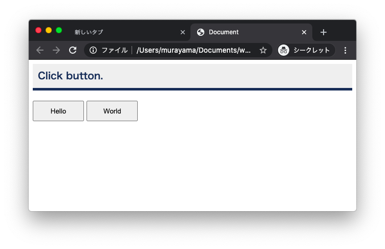

# 1 Webプログラミング

## 1.1 Webプログラミングとは

+ Web（インターネット）を活用したプログラミング
+ アプリケーションとWebアプリケーションの違い
+ フロントエンドとバックエンド


---

## 1.2 プログラミング言語

|言語|特徴|
|:--|:--|
|HTML|Webページを記述する言語|
|CSS|Webページの見栄えを調整する言語|
|JavaScript|Webブラウザ上で動作する言語|
|Python|AI、ディープラーニング、機械学習|
|PHP|Webアプリケーション開発|
|Java|ビジネスシーンでよく使われる言語|
|SQL|データベースを操作する言語|

---

## 1.3 Webプログラミングを始める前に

+ ファイルとフォルダ
+ GUIとCUI
+ テキストエディタとWebブラウザ

### Mac - Finder


### Mac - Terminal (iterm2)


### Text Edior - VS Code

https://code.visualstudio.com/


### Web Browser - Chrome

https://www.google.co.jp/chrome/


---

## 1.4 プログラミング

### hello.html

```html
<!DOCTYPE html>
<html lang="ja">
<head>
  <meta charset="UTF-8">
  <meta name="viewport" content="width=device-width, initial-scale=1.0">
  <title>Document</title>
  <style>
    h3 {
      color: #123456;
      background-color: #efefef;
      border-bottom: 5px solid #123456 ;  
      padding: 10px;
      margin: 0;
    }
    button {
      width: 100px;
      height: 40px;
    }
    div {
      margin-top: 20px;
    }
  </style>
  <script>
    function hello() {
      document.querySelector("h3").innerHTML = "Hello";
    }

    function world() {
      document.querySelector("h3").innerHTML = "World";
    }
  </script>
</head>
<body>
  <h3>Click button.</h3>
  <div>
    <button onclick="hello()">Hello</button>
    <button onclick="world()">World</button>  
  </div>
</body>
</html>
```




