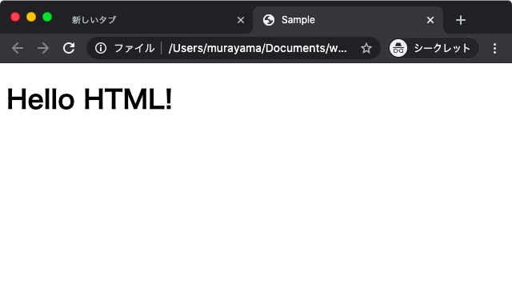

# HTML

## Hyper Text Markup Language

HTML(Hyper Text Markup Language)とはWebページを記述するための言語です。パソコンやスマホを使って、インターネットをしているときに、画面に表示されている内容のほとんどはHTMLで記述されています。

HTMLの名前の一部であるハイパーテキスト（Hyper Text）とは、リンク機能を持つテキストを意味しています。インターネットをしているとき、リンクをクリックして他のWebページを開くといった動作は誰もが経験していることでしょう。またHTMLの名前に含まれるマークアップ言語（Markup Language）とは、文書に対してマーク付けをしていくための言語であることを意味しています。このマーク付けには、HTMLに用意されているタグを使います。HTMLで記述された文書（HTMLファイル）をブラウザで表示すると、ブラウザによってマークアップされた文書が解析されて画面に表示されます。

## sample.html

```html
<!DOCTYPE html>
<html lang="ja">
<head>
  <meta charset="UTF-8">
  <title>Sample</title>
</head>
<body>
  <h1>Hello HTML!</h1>
</body>
</html>
```



## HTMLタグ

|タグ|意味|
|:--|:--|
|html|HTML文書|
|head|HTML文書のヘッダー|
|meta|HTML文書のメタ情報|
|title|HTML文書のタイトル|
|body|HTML文書のボディ|
|h1|見出し|

---

## 参考資料

+ [HyperText Markup Language](https://ja.wikipedia.org/wiki/HyperText_Markup_Language)
+ [HTML5](https://ja.wikipedia.org/wiki/HTML5)
+ [World Wide Web Consortium](https://ja.wikipedia.org/wiki/World_Wide_Web_Consortium)
