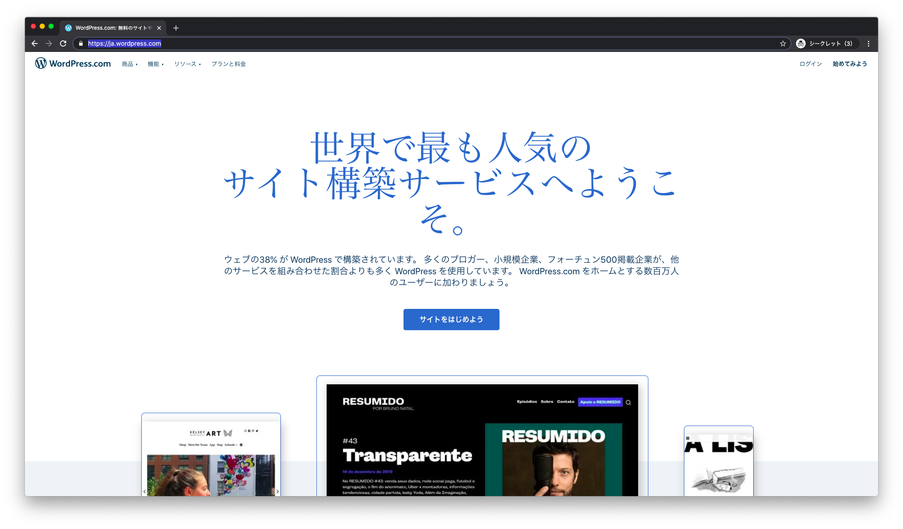
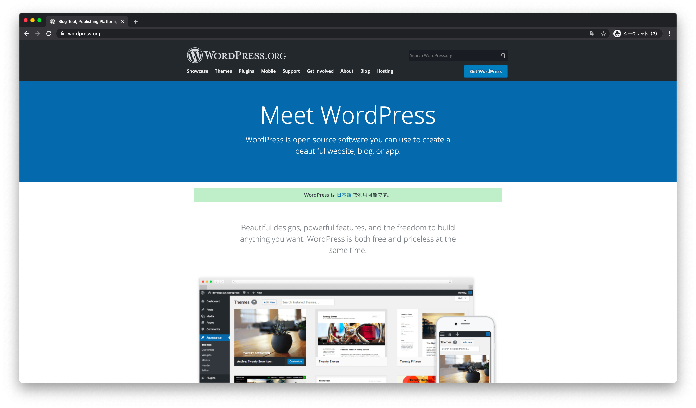
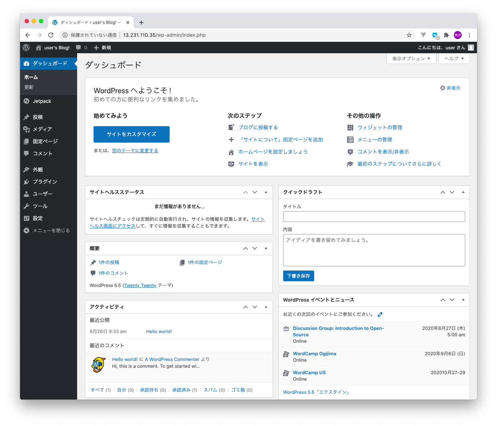

# 3 WordPress

## 3.1 WordPressとは

世界で最も利用されているブログ管理システムです。CMSと呼ばれることもあります。

> WordPress（ワードプレス）は、オープンソースのブログソフトウェアである。PHPで開発されており、データベース管理システムとしてMySQLを利用している（後述のプラグインよりSQLiteでの使用も可能）。単なるブログではなくコンテンツ管理システム (CMS) としてもしばしば利用されている。b2/cafelogというソフトウェアのフォーク（後継）として開発、2003年5月27日に初版がリリースされた[4]。GNU General Public License (GPL) の下で配布されている。https://ja.wikipedia.org/wiki/WordPress

### CMS（コンテンツ管理システム）

特別なプログラミング知識がなくてもデジタルコンテンツを管理・配信できる仕組み。ブログに限らず、Eラーニングシステムなど様々なものがあります。

> コンテンツ管理システムは、ウェブコンテンツを構成するテキストや画像などのデジタルコンテンツを統合・体系的に管理し、配信など必要な処理を行うシステムの総称。2005年頃より一般的に普及したといわれる。コンテンツマネージメントシステムとも呼ばれる。https://ja.wikipedia.org/wiki/%E3%82%B3%E3%83%B3%E3%83%86%E3%83%B3%E3%83%84%E7%AE%A1%E7%90%86%E3%82%B7%E3%82%B9%E3%83%86%E3%83%A0

---

## 3.2 wordpress .comと .org

* [https://ja.wordpress.com/](https://ja.wordpress.com/)
  + 有料（一部無料）のWordPressサービス

    

* [https://wordpress.org/](https://wordpress.org/)
  + オープンソースソフトウェアWordPressの配布元サイト

    

||メリット|デメリット|
|:--|:--|:--|
|.com|管理が容易（フルマネージド）|お金がかかる かゆいところに手が届かないことも|
|.org|カスタマイズ性が高い|準備・バージョンアップにコストがかかる プログラミングの知識が必要|

---

## 3.3 WordPressを支えるテクノロジー

* HTML/CSS/JavaScript
* PHP
* MySQL

### Static web page.

### Dynamic web page.

---

## 3.4 WordPressで知っておくべきこと

* 管理サイト
  + 投稿と固定ページ、メディア
    - 投稿：記事、ニュースのような日々作成するもの
      + 記事にはカテゴリーや、タグを指定できる
    - 固定ページ：会社概要ページのような更新頻度の少ないもの
    - メディア：画像ファイルや音声・動画ファイルなどを投稿する（投稿や固定ページから参照可能となる）
    > 一般的な作業の割合としては投稿ページを作成することが多くなります。
  + 外観（テーマ）とプラグイン
    - [外観（テーマ）](https://ja.wordpress.org/themes/)：サイトのデザインを整えるもの
      + テーマを選択するとサイトのデザインを一新できる
      + ウィジェットやメニューも作成できる
      + テーマエディターでCSSなどのプログラムをカスタマイズできる
    - [プラグイン](https://ja.wordpress.org/plugins/)：サイトに機能を追加するもの
      + [Contact Form 7](https://ja.wordpress.org/plugins/contact-form-7/)
      + [All in One SEO Pack](https://ja.wordpress.org/plugins/all-in-one-seo-pack/)
      + [Classic Editor](https://ja.wordpress.org/plugins/classic-editor/)
    > テーマの変更やプラグインの追加はサイト上で簡単に行うことができます。ただし、テーマもプラグインもソフトウェアであるためバグが存在する可能性があります。事前に検証用のサイトで、テストを実施してから導入することが一般的です。
  + 設定
    + 一般設定：サイトのタイトルやキャッチフレーズなど
    + 表示設定：1ページの投稿数や、検索エンジンのインデックス有無の指定など
    + パーマリンク設定：URLのカスタマイズなど
    > 設定項目は、頻繁に変更するものではありません。
    
 

> 管理サイトの操作は簡単ですが、直接サーバにログインしてファイルやフォルダを編集する方が効率の良いケースもあります。

---

## 3.5 自分でWordPressでサイトを作るには

+ さくらインターネット、エックスサーバーのようなレンタルサーバ会社と契約すると、WordPressのサイトを自作できます。
